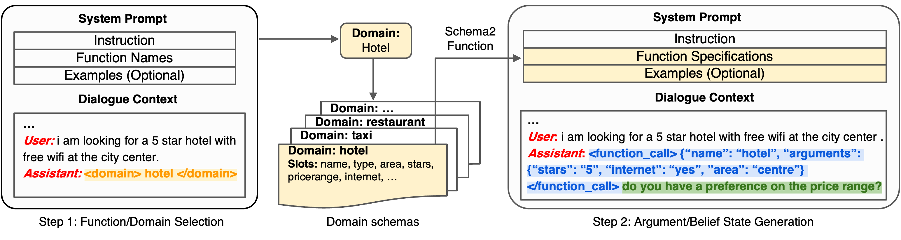
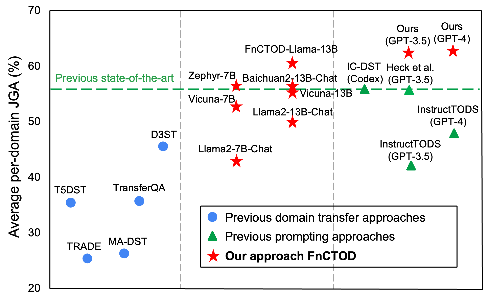

# Large Language Models as Zero-shot Dialogue State Tracker through Function Calling
This repository provides the official PyTorch implementation of the following paper: 
> [**Large Language Models as Zero-shot Dialogue State Tracker through Function Calling**](https://arxiv.org/abs/2402.10466) <br>

## Overview
<p align="center"></p>

We introduce a novel approach FnCTOD, to address zero-shot DST with LLMs. Our method seamlessly integrates DST as a part of the assistant's output during chat completion. Specifically, we treat the schema of each task-oriented dialogue domain as a specific function, and DST for this domain as the process of ``calling'' the corresponding function. We thus instruct LLMs to generate function calls along with the response in the assistant's output. To achieve this, we convert the domain schema into function specifications, which include the function's description and required arguments, and incorporate them into the **system prompt** of the LLM. Additionally, we integrate these function calls into the assistant's output within the *dialogue context*.

<p align="center"></p>

**Zero-shot DST performance comparison** among (1) previous domain transfer approaches using small models; (2) previous prompting approaches exclusively relying on advanced proprietary LLMs; and (3) our approach, compatible with various LLMs, empowers various 7B and 13B models for superior performance and sets new state-of-the-art with GPT-4.

## Preparation
Before running the scripts, follow these steps to set up your environment:
1. Data Directory Setup: Unzip the `data.zip` file and place the `data` directory in the root (main) directory of the project.
2. Conda Environment Setup: `pip install -r requirements.txt`
3. Environment Variable Configuration: Set the following environment variables for local model inference in each evaluation script:
```
export TRANSFORMERS_CACHE='/XXX/.cache/huggingface/transformers'
export HF_HOME='/XXX/.cache/huggingface'
export OPENAI_API_KEY='XXXX'
```

## In-context Prompting
Execute the following scripts located in the `./sh_folders/` directory to run inference with different models.
   1. `inference_chatgpt.sh`
   2. `inference_fnctod-llama.sh`
   3. `inference_zephyr.sh`
   4. `inference_vicuna-7b.sh`
   5. `inference_vicuna-13b.sh`
   6. `inference_baichuan-13b.sh`
   7. `inference_llama-2-7b.sh`
   8. `inference_llama-2-13b.sh`
   9. `inference_llama-2-70b.sh`

## Prompt-based Fine-tuning

1. Fine-tuning data sampling: `sh create_data.sh`
2. Finetune FnCTOD-Llama: `sh finetune.sh`


## Citation
If you find this work useful, please cite [our paper](https://arxiv.org/abs/2402.10466):
```
@article{li2024large,
  title={Large Language Models as Zero-shot Dialogue State Tracker through Function Calling},
  author={Li, Zekun and Chen, Zhiyu Zoey and Ross, Mike and Huber, Patrick and Moon, Seungwhan and Lin, Zhaojiang and Dong, Xin Luna and Sagar, Adithya and Yan, Xifeng and Crook, Paul A},
  journal={arXiv preprint arXiv:2402.10466},
  year={2024}
}
```
