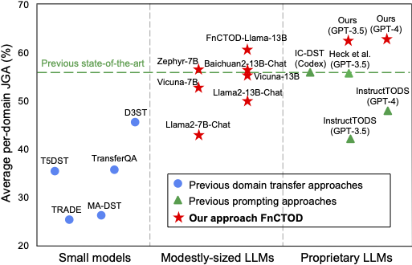

# Large Language Models as Zero-shot Dialogue State Tracker through Function Calling
This repository provides the official PyTorch implementation of the following paper: 
> [**Large Language Models as Zero-shot Dialogue State Tracker through Function Calling**](https://arxiv.org/abs/2402.10466) <br>

## Overview
<p align="center"></p>

We introduce a novel approach FnCTOD, to address zero-shot DST with LLMs. Our method seamlessly integrates DST as a part of the assistant's output during chat completion. Specifically, we treat the schema of each task-oriented dialogue domain as a specific function, and DST for this domain as the process of ``calling'' the corresponding function. We thus instruct LLMs to generate function calls along with the response in the assistant's output. To achieve this, we convert the domain schema into function specifications, which include the function's description and required arguments, and incorporate them into the **system prompt** of the LLM. Additionally, we integrate these function calls into the assistant's output within the *dialogue context*.

<p align="center"></p>

**Zero-shot DST performance comparison** among (1) previous domain transfer approaches using small models; (2) previous prompting approaches exclusively relying on advanced proprietary LLMs; and (3) our approach, compatible with various LLMs, empowers various 7B and 13B models for superior performance and sets new state-of-the-art with GPT-4.

## Data Preparation
The detailed instruction for preparing the benchmark dataset MultiWOZ and pre-training corpora (optional) are provided in the `./data` folder.

## Environment Setup
1. Requires Python 3.8 &ndash; 3.11
2. Conda Environment Setup: `pip install -r requirements.txt`
3. Environment Variable Configuration: Set the following environment variables for local model inference in each evaluation script:
```
export TRANSFORMERS_CACHE='/HOME_PATH/.cache/huggingface/transformers'
export HF_HOME='/HOME_PATH/.cache/huggingface'
export OPENAI_API_KEY='XXXX'
```

## In-context Prompting
Execute the following scripts located in the `./scripts/` directory to run inference with different models.
   1. `inference_chatgpt.sh`
   2. `inference_fnctod-llama.sh`
   3. `inference_oss_models.sh`

## Prompt-based Fine-tuning
1. For each dataset used in the training, including CamRest676, MSE2E, SGD, Taskmaster, and WoZ, first process the data, then format it in our dialogue prompt for training. Here is an example for the SGD dataset:
```
cd scripts
sh processing-sgd.sh
sh prompting-sgd.sh

```
2. Collect the data from different datasets: 
```
cd scripts
sh create_finetunedata.sh
```

3. Finetune FnCTOD-Llama2:
```
cd scripts
sh finetune.sh
```

## Acknowledgements
1. [UBAR](https://github.com/TonyNemo/UBAR-MultiWOZ): upon which our data processing code is built. 
2. [PPTOD](https://github.com/awslabs/pptod): upon which our evaluation code is built.
3. [FastChat](https://github.com/lm-sys/FastChat): we borrowed the chat templates from this repository.

We thank the authors for their wonderful work.

## License
See the [LICENSE](./LICENSE) file for details about the license under which this code is made available.

## Citation
If you find this work useful, please cite [our paper](https://arxiv.org/abs/2402.10466):
```
@article{li2024large,
  title={Large Language Models as Zero-shot Dialogue State Tracker through Function Calling},
  author={Li, Zekun and Chen, Zhiyu Zoey and Ross, Mike and Huber, Patrick and Moon, Seungwhan and Lin, Zhaojiang and Dong, Xin Luna and Sagar, Adithya and Yan, Xifeng and Crook, Paul A},
  journal={arXiv preprint arXiv:2402.10466},
  year={2024}
}
```
